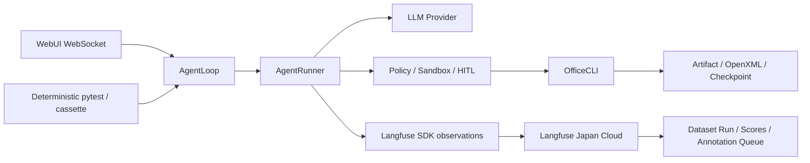

# Mybot

基于 [nanobot](https://github.com/HKUDS/nanobot) v0.2.1 二次开发的个人 AI 助手。

## 技术栈

- **后端**: Python 3.11+ / nanobot 0.2.1
- **前端**: React 18 + TypeScript + Vite + Tailwind CSS
- **模型**: 内置 DeepSeek V4 与中转站 GPT-5.6 Sol/Terra/Luna 预设，可运行时切换
- **交互**: WebSocket + WebUI

## 快速开始

```bash
# 1. 创建虚拟环境并安装
python3.11 -m venv venv
source venv/bin/activate
pip install -e .

# 安装后会同时提供 officecli 启动器；首次使用时自动下载并校验固定版本 v1.0.135
officecli --version

# 2. 构建前端
cd webui && bun install && bun run build && cd ..

# 3. 配置 API Key
# 编辑 ~/.nanobot/config.json，按需填写：
# providers.deepseek.apiKey     # DeepSeek V4 Pro / Flash
# providers.openai.apiKey       # GPT-5.6 中转站
# providers.openai.apiBase      # 例如 https://your-relay.example/v1
# providers.xiaomiMimo.apiKey   # 可选，仅用于 Xiaomi MiMo 语音转写

# 4. 启动
nanobot gateway
```

以后可直接运行项目根目录的 `./start_gateway.sh`，无需重复进入目录和激活虚拟环境；也可以双击 `start_gateway.command` 在 macOS Terminal 中启动。

OfficeCLI 不使用上游的 latest 安装脚本。项目启动器会根据
`nanobot/skills/officecli/references/officecli-runtime.json` 选择当前平台资产，校验
SHA-256，缓存到 `~/.nanobot/officecli/`，并在每次执行时关闭上游自动更新。首次使用需
联网；下载完成后可直接复用本地缓存。

启动后浏览器访问 **http://127.0.0.1:8765/webui**

## PTC / Code Mode

多步工具任务可选择 Programmatic Tool Calling，让模型生成一个 async Python 函数体，在独立
子进程中循环、分支或并发调用现有工具，只把整理后的 `print`/`return` 结果送回模型。默认保持
原生工具调用。可在 WebUI 的“设置 → 系统 → 工具调用”中选择 Native、Code 或 Both，保存后从
下一轮模型请求直接生效，无需重启；也可以在 `~/.nanobot/config.json` 中显式启用：

```json
{
  "tools": {
    "mode": "code",
    "ptc": {
      "maxParallelSubCalls": 10,
      "computeTimeoutSeconds": 60,
      "wallTimeoutSeconds": 600,
      "maxOutputChars": 65536,
      "sandbox": "auto"
    }
  }
}
```

`mode` 还支持 `both`，用于同时保留原生工具和 `run_code` 做灰度比较。`sandbox: auto` 使用现有
会话权限对应的 OS sandbox；不可用时 Code Mode 会明确拒绝启动，不会降级为进程内执行。
PTC 是工具编排、时延和上下文优化，不是额外的多租户安全边界。

## Runtime 架构



Runtime 状态、Policy、文件和 artifact 仍由 Mybot 管理；启用 Cloud 后 Langfuse 是 Trace、Experiment、Score 和人工审核的唯一持久记录。默认 `observability.langfuse.enabled=false`，普通任务不会因为 Cloud 不可用而阻塞，也不承诺离线补传。

## Office Skill

Office benchmark 固定使用 `officecli`，在相同输入、Policy 和 evaluator 下分别运行 `gpt-5-6-luna` 与 `deepseek-v4-flash`。两种模型共享 workspace、OCC、artifact 和 OpenXML hard gate 约束。

无 Key 的确定性回归：

```bash
nanobot benchmark run --profile ci
pytest tests/runtime/ tests/skills/ -q
```

## Langfuse 与公开 benchmark

需要真实观测或 benchmark 时，在日本区 [Langfuse Cloud](https://jp.cloud.langfuse.com) 创建 Project，并在 `~/.nanobot/config.json` 配置项目 Key；也可使用同名环境变量：

```json
{
  "observability": {
    "langfuse": {
      "enabled": true,
      "baseUrl": "https://jp.cloud.langfuse.com",
      "publicKey": "pk-lf-...",
      "secretKey": "sk-lf-...",
      "captureContent": false
    }
  }
}
```

公开 benchmark 需要在 Langfuse Project 中配置 Terra Custom LLM Connection：model `gpt-5.6-terra`、OpenAI-compatible base URL 和 key；这些凭据只保存在 Langfuse，不写入 Mybot 或前端。上传 OCB 正文前必须完成许可证审查，并显式使用 `prepare --allow-licensed-content`。`prepare` 还要求外部 LibreOffice 的绝对路径和精确 `soffice --version`；`estimate` 统计 Luna、DeepSeek V4 Flash Agent 与 Terra Judge 的预计 token。Office release 的 25%/50% 档使用固定 seed 分层抽样，同一 prepared manifest 可复现且 25% 是 50% 的子集，不按原始顺序直接取前 N。

普通任务建议保持 `captureContent=false`；公开 benchmark 在许可证审查通过且需要把 prompt/material 交给 Terra Judge 时，必须将其改为 `true`。敏感数据不得通过该开关上传。

```bash
nanobot benchmark prepare --profile office-smoke \
  --soffice /absolute/path/to/soffice \
  --soffice-version 'LibreOffice ...' \
  --allow-licensed-content
nanobot benchmark estimate --profile office-smoke --model-preset gpt-5-6-luna --model-preset deepseek-v4-flash
nanobot benchmark run --profile office-smoke --model-preset gpt-5-6-luna --model-preset deepseek-v4-flash
nanobot benchmark estimate --profile office-release --ocb-sample 255
nanobot benchmark run --profile office-release --ocb-sample 255
nanobot benchmark export --dataset-run <langfuse-dataset-run-id>
```

OCB 的 `mybot_score` 是通过 Terra LLM-as-a-Judge 得到的 Mybot evaluation，不能当作官方榜单分数或 `official-comparable`。原始 Office 文件、完整 trace 和未获许可的媒体留在外部 cache。

<!-- benchmark-results:begin -->
### Benchmark 结果

尚未发布经过日本区 Langfuse Dataset Run、Terra Judge 和 Annotation Queue 审核的真实 benchmark 结果。这里只接受 `nanobot benchmark export --dataset-run <id>` 自动写入的去敏快照，不手工填写数字。
<!-- benchmark-results:end -->

## 已知边界

- Langfuse Cloud 属于跨境数据传输；公司、客户、个人或敏感内容在合规审查前保持关闭。
- Annotation Queue 人工分数和 release 全量质量尚未在本仓库声称完成。
- 确定性 fixture、cassette 和 fake-provider 报告证明 Runtime hard gate，不代表真实模型 Office 质量。

## 模型切换

默认模型为 `deepseek-v4-pro`。内置可切换预设：

| 预设名 | 模型 | Provider | 默认 Base URL |
|--------|------|----------|---------------|
| `deepseek-v4-pro` | `deepseek-v4-pro` | `deepseek` | `https://api.deepseek.com` |
| `deepseek-v4-flash` | `deepseek-v4-flash` | `deepseek` | `https://api.deepseek.com` |
| `gpt-5-6-sol` | `gpt-5.6-sol` | `openai` | 由 `providers.openai.apiBase` 配置 |
| `gpt-5-6-terra` | `gpt-5.6-terra` | `openai` | 由 `providers.openai.apiBase` 配置 |
| `gpt-5-6-luna` | `gpt-5.6-luna` | `openai` | 由 `providers.openai.apiBase` 配置 |

WebUI 设置页提供模型配置列表，可新增、编辑、切换和删除自定义配置；输入框右下角菜单用于快速切换。也可以发送 `/model` 查看当前模型和可用预设，例如 `/model gpt-5-6-terra`。

## 项目结构

```
├── nanobot/               # 后端核心
│   ├── agent/             # Agent 循环、工具、记忆
│   ├── channels/          # 消息通道（默认仅启用 WebSocket，其他通道代码保留）
│   ├── providers/         # LLM 提供商
│   ├── config/            # 配置管理
│   └── cli/               # CLI 入口
├── webui/                 # 前端 React + Vite + Tailwind
├── tests/                 # 测试
├── pyproject.toml
├── hatch_build.py
└── LICENSE                # MIT
```

## 与原 nanobot 的区别

- 在原有 AgentLoop / AgentRunner 主链上增加 Plan DAG、Policy/HITL、OS Sandbox、文件 OCC、
  Artifact/Checkpoint、受控 Subagent、Trace/Eval 和 Skill 自进化等 Runtime 能力。

## 许可证

基于 nanobot，沿用 [MIT License](LICENSE)。
